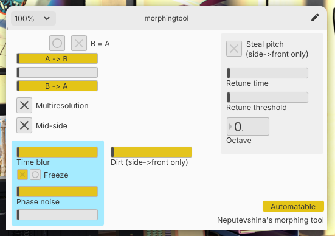

## Morphing tool
Simple multiresolution cross-synthesizer.

### Legend
- **A → B**. Crossfade between front and side chain phase bins (modulator select).
- **B → A**. Crossfade between side and front chain magnitude bins (carrier select).
  - If both sliders are in B position, the output from this stage of plugin will be the unmodified side chain.
    Correspondingly, if both sliders are in A position, the output of stage will be the unmodified front chain.
- **Gray unlabled fader**. Move both the A→B and the B→A.
- **Multiresolution**. Enable multiresolution processing. 3x more CPU usage with improved quality of bass and treble.
- **Mid-side**. Morph between mids and sides of inputs, not between lefts and rights.
- **Time blur**. The amount of decay of the carrier magnitudes.
- **Phase noise**. The amount of noise mixed in the modulator. If fully on right, the modulator will be noise.
- **Another gray unlabled fader**. Change both the time blur and the phase noise amounts, resulting in reverb-like effect.
- **Dirt**. Amplitude modulation of the front chain with the side chain.
- **Steal pitch toggle**. Enable VERY experimental (read broken) autotune-with-sidechain functionality.
- **Retune time**. Obvious.
- **Retune threshold**. The minimum quality of pitches to be reacted to.
- **Octave**. Shift the octave of detected pitches of modulator.

## Normalizer
Pumping maximizer. A compressor without threshold and ratio.

